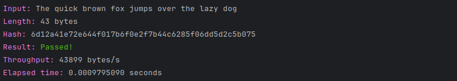

# tiger-hash

## Laboratorium 1

Przedmiotem projektu jest implementacja algorytmu Tiger Hash w języku Python. Tiger Hash jest algorytmem
kryptograficznym z grupy funkcji skrótu. Został zaprojektowany przez Rossa Andersona i Eli Biham w 1995 roku. Rozmiar
skrótu wynosi `192` bity. Metoda dopełnienia polega na uzupełnieniu wiadomości pojedynczym bitem `1`, a następnie
dopełnienie jej ciągiem bitów `0`, a na końcu długość wiadomości jako 64-bitowe słowo. Wynik dzielony jest na `n`
512-bitowych bloków. Jego główną operacją jest przeszukiwanie tabeli w czterech S-boxach, każdy od ośmiu do 64 bitów.
Pozostałe operacje to
64-bitowe dodawanie i odejmowanie, 64-bitowe mnożenie przez małe stałe (5, 7 i 9), 64-bitowe przesunięcia i operacje
logiczne, takie jak XOR i NOT.

Zaimplementowany program może zostać uruchomiony w trybie interaktywnym (nie podając żadnych argumentów) lub w trybie
testowania (podając argument `test` do wywołania programu).

W trybie interaktywnym użytkownik wprowadza oczekiwaną długość skrótu (w bitach) oraz ścieżkę do pliku, który zawiera
wiadomość do przetworzenia. Wynik działania programu zostanie wyświetlony na ekranie. Wygenerowany skrót zostanie
również zapisany na dysku do pliku `hash.txt`.


W trybie testowania program wykonuje testy zdefiniowanych wektorów testowych. Wyniki działąnia programu zostaną
wyświetlone na ekranie. Poniżej przedstawiono przykładowe wyniki działania programu dla zadanych wektorów testowych.

- Input: `The quick brown fox jumps over the lazy dog`



- Input: `The quick brown fox jumps over the lazy cog`


- Input: `""`


- Input: zawartość pliku `file_mb_1.txt`


Jak można zauważyć, wyniki działania programu są poprawne. Porównując wiadomości dla dwóch pierwszych przykładów można
zauważyć, że zmiana jednej litery w wiadomości powoduje całkowitą zmianę wyniku. Otrzymywane wyniki zostały porównane z
wynikami autorów opisanymi na
stronie https://en.wikipedia.org/wiki/Tiger_(hash_function) oraz z wykorzystaniem narzędzia dostępnego pod
adresem https://md5hashing.net/hash/tiger192.

## Laboratorium 2

Szybkość działąnia programu została zmierzona dla różnych długości wiadomości. Poniższa tabela przedstawia otrzymane
wyniki wraz z przepustowością.

| Plik           | Długość wiadomości [bytes] | Czas działania [s] | Przepustowość [bytes/s] |
|----------------|----------------------------|--------------------|-------------------------|
| file_b_0.txt   | 0                          | 0.0000775400       | -                       |
| file_b_100.txt | 100                        | 0.0001230120       | 812 928                 |
| file_kb_1.txt  | 1 024                      | 0.0008583750       | 1 192 951               |
| file_mb_1.txt  | 1 048 576                  | 0.6576534020       | 1 594 420               |

Przeprowadzony został również test efektu lawinowości dla zaimplementowanej funkcji skrótu. Na potrzeby
testów przyjęto pozycję bitu `k = 69` oraz ilość iteracji ustalono na `r = 44_739_243`.

W kontekście działania programu uruchomienie go z
argumentem `avalanche_effect_test` spowoduje wygenerowanie pliku testowego, który może zostać poddany analizie za pomocą
narzędzia `dieharder`. Program uruchomiony w tym trybie wymaga podania pozycji bitu, który będzie negowany. Następnie
generowany jest plik z danymi testowymi, a o postępie informują kolejne wiadomości wyświetlane na ekranie. Postęp
wyświetlany jest co `10_000` obiegów pętli. Wraz z informacją o procencie postępu wyświetlana jest również
informacja o przewidywanym czasie pozostałym do zakończenia generowania pliku testowego. Poniżej przedstawiono fragment
działania
programu.


Wyniki otrzymane z narzędzia `dieharder` zostały przedstawione w poniższej tabeli.

```
#=============================================================================#
#            dieharder version 3.31.1 Copyright 2003 Robert G. Brown          #
#=============================================================================#
   rng_name    |           filename             |rands/second|
        mt19937|             dieharder_input.txt|  1.81e+08  |
#=============================================================================#
        test_name   |ntup| tsamples |psamples|  p-value |Assessment
#=============================================================================#
   diehard_birthdays|   0|       100|     100|0.98143711|  PASSED  
      diehard_operm5|   0|   1000000|     100|0.54104656|  PASSED  
  diehard_rank_32x32|   0|     40000|     100|0.67715604|  PASSED  
    diehard_rank_6x8|   0|    100000|     100|0.36236327|  PASSED  
   diehard_bitstream|   0|   2097152|     100|0.50933665|  PASSED  
        diehard_opso|   0|   2097152|     100|0.22296190|  PASSED  
        diehard_oqso|   0|   2097152|     100|0.74642492|  PASSED  
         diehard_dna|   0|   2097152|     100|0.79221673|  PASSED  
diehard_count_1s_str|   0|    256000|     100|0.22517417|  PASSED  
diehard_count_1s_byt|   0|    256000|     100|0.96774024|  PASSED  
 diehard_parking_lot|   0|     12000|     100|0.78148856|  PASSED  
    diehard_2dsphere|   2|      8000|     100|0.26455640|  PASSED  
    diehard_3dsphere|   3|      4000|     100|0.32058305|  PASSED  
     diehard_squeeze|   0|    100000|     100|0.00714805|  PASSED  
        diehard_sums|   0|       100|     100|0.07456917|  PASSED  
        diehard_runs|   0|    100000|     100|0.58159850|  PASSED  
        diehard_runs|   0|    100000|     100|0.46092017|  PASSED  
       diehard_craps|   0|    200000|     100|0.36983582|  PASSED  
       diehard_craps|   0|    200000|     100|0.26638407|  PASSED  
 marsaglia_tsang_gcd|   0|  10000000|     100|0.24655211|  PASSED  
 marsaglia_tsang_gcd|   0|  10000000|     100|0.15827147|  PASSED  
         sts_monobit|   1|    100000|     100|0.74971687|  PASSED  
            sts_runs|   2|    100000|     100|0.99879538|   WEAK   
          sts_serial|   1|    100000|     100|0.99752501|   WEAK   
          sts_serial|   2|    100000|     100|0.52909547|  PASSED  
          sts_serial|   3|    100000|     100|0.45765570|  PASSED  
          sts_serial|   3|    100000|     100|0.44333575|  PASSED  
          sts_serial|   4|    100000|     100|0.67569828|  PASSED  
          sts_serial|   4|    100000|     100|0.50192829|  PASSED  
          sts_serial|   5|    100000|     100|0.96296601|  PASSED  
          sts_serial|   5|    100000|     100|0.67095119|  PASSED  
          sts_serial|   6|    100000|     100|0.36297561|  PASSED  
          sts_serial|   6|    100000|     100|0.85953567|  PASSED  
          sts_serial|   7|    100000|     100|0.66799675|  PASSED  
          sts_serial|   7|    100000|     100|0.85712850|  PASSED  
          sts_serial|   8|    100000|     100|0.17859020|  PASSED  
          sts_serial|   8|    100000|     100|0.80143019|  PASSED  
          sts_serial|   9|    100000|     100|0.88769661|  PASSED  
          sts_serial|   9|    100000|     100|0.54234642|  PASSED  
          sts_serial|  10|    100000|     100|0.47217012|  PASSED  
          sts_serial|  10|    100000|     100|0.26200441|  PASSED  
          sts_serial|  11|    100000|     100|0.92360974|  PASSED  
          sts_serial|  11|    100000|     100|0.31801319|  PASSED  
          sts_serial|  12|    100000|     100|0.73424386|  PASSED  
          sts_serial|  12|    100000|     100|0.95893176|  PASSED  
          sts_serial|  13|    100000|     100|0.37858833|  PASSED  
          sts_serial|  13|    100000|     100|0.92025293|  PASSED  
          sts_serial|  14|    100000|     100|0.50502107|  PASSED  
          sts_serial|  14|    100000|     100|0.56689666|  PASSED  
          sts_serial|  15|    100000|     100|0.55904079|  PASSED  
          sts_serial|  15|    100000|     100|0.21156974|  PASSED  
          sts_serial|  16|    100000|     100|0.51053517|  PASSED  
          sts_serial|  16|    100000|     100|0.44494046|  PASSED  
         rgb_bitdist|   1|    100000|     100|0.92131322|  PASSED  
         rgb_bitdist|   2|    100000|     100|0.98139582|  PASSED  
         rgb_bitdist|   3|    100000|     100|0.92820239|  PASSED  
         rgb_bitdist|   4|    100000|     100|0.55118469|  PASSED  
         rgb_bitdist|   5|    100000|     100|0.58300548|  PASSED  
         rgb_bitdist|   6|    100000|     100|0.81451438|  PASSED  
         rgb_bitdist|   7|    100000|     100|0.50260261|  PASSED  
         rgb_bitdist|   8|    100000|     100|0.74834464|  PASSED  
         rgb_bitdist|   9|    100000|     100|0.64236822|  PASSED  
         rgb_bitdist|  10|    100000|     100|0.24315267|  PASSED  
         rgb_bitdist|  11|    100000|     100|0.99999057|   WEAK   
         rgb_bitdist|  12|    100000|     100|0.83477296|  PASSED  
rgb_minimum_distance|   2|     10000|    1000|0.33870008|  PASSED  
rgb_minimum_distance|   3|     10000|    1000|0.69380266|  PASSED  
rgb_minimum_distance|   4|     10000|    1000|0.30932234|  PASSED  
rgb_minimum_distance|   5|     10000|    1000|0.05561909|  PASSED  
    rgb_permutations|   2|    100000|     100|0.59953567|  PASSED  
    rgb_permutations|   3|    100000|     100|0.46470676|  PASSED  
    rgb_permutations|   4|    100000|     100|0.96206830|  PASSED  
    rgb_permutations|   5|    100000|     100|0.06361663|  PASSED  
      rgb_lagged_sum|   0|   1000000|     100|0.79137419|  PASSED  
      rgb_lagged_sum|   1|   1000000|     100|0.44433517|  PASSED  
      rgb_lagged_sum|   2|   1000000|     100|0.06843258|  PASSED  
      rgb_lagged_sum|   3|   1000000|     100|0.66844133|  PASSED  
      rgb_lagged_sum|   4|   1000000|     100|0.37911972|  PASSED  
      rgb_lagged_sum|   5|   1000000|     100|0.59940499|  PASSED  
      rgb_lagged_sum|   6|   1000000|     100|0.65571122|  PASSED  
      rgb_lagged_sum|   7|   1000000|     100|0.99387485|  PASSED  
      rgb_lagged_sum|   8|   1000000|     100|0.99469648|  PASSED  
      rgb_lagged_sum|   9|   1000000|     100|0.68683320|  PASSED  
      rgb_lagged_sum|  10|   1000000|     100|0.87690435|  PASSED  
      rgb_lagged_sum|  11|   1000000|     100|0.39173580|  PASSED  
      rgb_lagged_sum|  12|   1000000|     100|0.14822667|  PASSED  
      rgb_lagged_sum|  13|   1000000|     100|0.69694850|  PASSED  
      rgb_lagged_sum|  14|   1000000|     100|0.96600241|  PASSED  
      rgb_lagged_sum|  15|   1000000|     100|0.82973708|  PASSED  
      rgb_lagged_sum|  16|   1000000|     100|0.08341398|  PASSED  
      rgb_lagged_sum|  17|   1000000|     100|0.74021621|  PASSED  
      rgb_lagged_sum|  18|   1000000|     100|0.79995785|  PASSED  
      rgb_lagged_sum|  19|   1000000|     100|0.99174164|  PASSED  
      rgb_lagged_sum|  20|   1000000|     100|0.81707757|  PASSED  
      rgb_lagged_sum|  21|   1000000|     100|0.55612669|  PASSED  
      rgb_lagged_sum|  22|   1000000|     100|0.99934775|   WEAK   
      rgb_lagged_sum|  23|   1000000|     100|0.95748418|  PASSED  
      rgb_lagged_sum|  24|   1000000|     100|0.19409705|  PASSED  
      rgb_lagged_sum|  25|   1000000|     100|0.89599742|  PASSED  
      rgb_lagged_sum|  26|   1000000|     100|0.29637778|  PASSED  
      rgb_lagged_sum|  27|   1000000|     100|0.15092270|  PASSED  
      rgb_lagged_sum|  28|   1000000|     100|0.23323045|  PASSED  
      rgb_lagged_sum|  29|   1000000|     100|0.03533693|  PASSED  
      rgb_lagged_sum|  30|   1000000|     100|0.58572094|  PASSED  
      rgb_lagged_sum|  31|   1000000|     100|0.89425722|  PASSED  
      rgb_lagged_sum|  32|   1000000|     100|0.92199802|  PASSED  
     rgb_kstest_test|   0|     10000|    1000|0.92696634|  PASSED  
     dab_bytedistrib|   0|  51200000|       1|0.08926465|  PASSED  
             dab_dct| 256|     50000|       1|0.70257898|  PASSED  
Preparing to run test 207.  ntuple = 0
        dab_filltree|  32|  15000000|       1|0.55401013|  PASSED  
        dab_filltree|  32|  15000000|       1|0.08004954|  PASSED  
Preparing to run test 208.  ntuple = 0
       dab_filltree2|   0|   5000000|       1|0.25113675|  PASSED  
       dab_filltree2|   1|   5000000|       1|0.70844515|  PASSED  
Preparing to run test 209.  ntuple = 0
        dab_monobit2|  12|  65000000|       1|0.09344604|  PASSED 
```

Jak można zauważyć znakomita większość testów zakończyła się powodzeniem co sugeruje informacja `PASSED` przy większości
przeprowadzonych testów. Spośród 114 testów zaledwie 4 z nich zakończyły się statusem `WEAK`. Żaden z nich nie zakończył
się wynikiem `FAIL`. Na podstawie otrzymanych wyników można stwierdzić, że zaimplementowana funkcja skrótu nie posiada
znaczących wad. Dla bitu wejściowego `k = 69` możemy stwierdzić, że zaimplementowana funkcja skrótu wykazuje efekt
lawinowości, a wygenerowany ciąg znaków można uznać za losowy.
